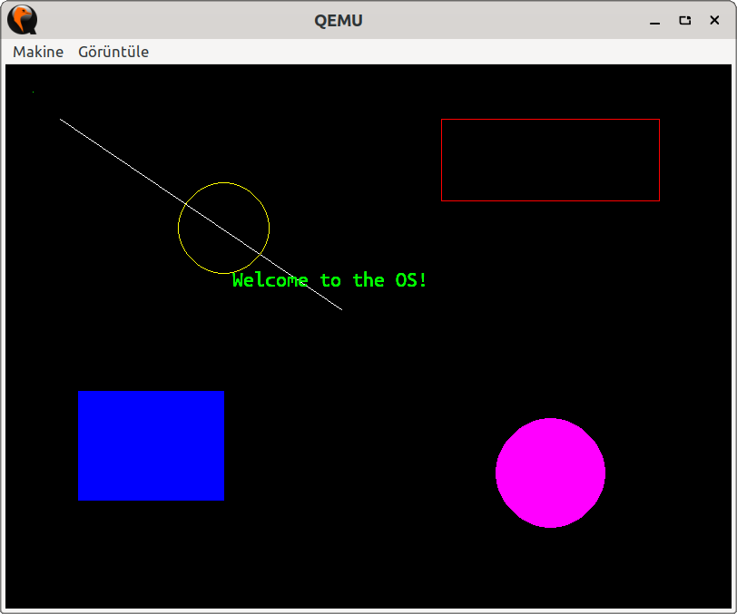

# os

Erdem Ersoy's New OS. Uses Pardus 23's Linux kernel. Written with GitHub Copilot.

**NOTE:** This project is a stub.



## Required Pardus 23 Packages

``` 
build-essential qemu-system-x86
```

## Building and Running

To build the project, run:

```
make build
```

To run the OS in QEMU, run:

```
make run
```

To clean build artifacts, run:

```
make clean
```

## Copyright and License

Copyright (c) 2025 Erdem Ersoy (eersoy93).

Licensed with GPLv3. See LICENSE file for deatils.
